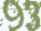
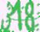
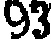
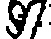
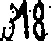
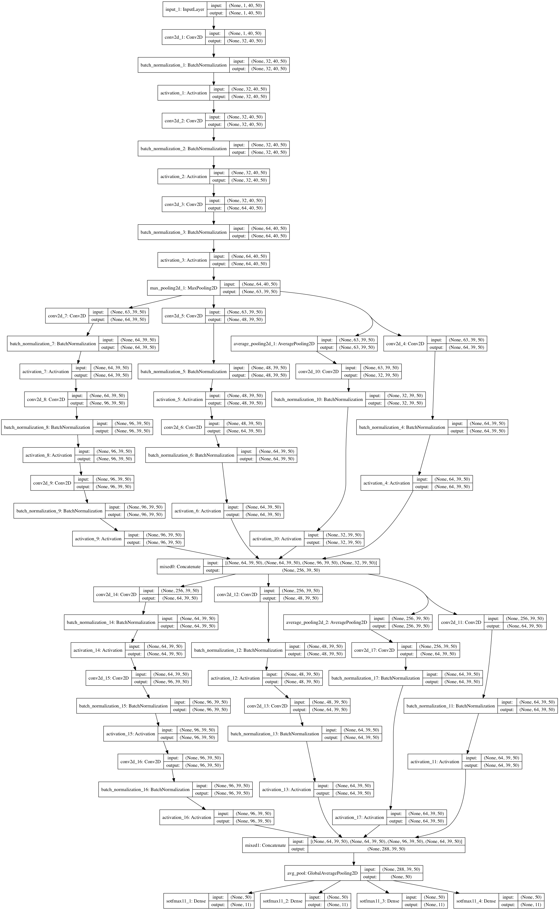

# CaptchaRecognition 說明文檔

文件目錄說明

```Tree
.
├── README.md
├── data
│   ├── 0.tfrecords
│   ├── ...
│   ├── images
│   │   ├── ...
│   └── labels
│       └── labels.csv
├── data.tar.gz
├── googLeNet.py
├── img2tfrecords.ipynb
├── main.py
├── model.png
├── model.py
├── my_model.py
├── test.py
├── test.h5
└── web
    ├── db.sqlite3
    ├── manage.py
    ├── static
    │   ├── css
    │   ├── fonts
    │   ├── img
    │   ├── js
    │   ├── model
    │   └── upload
    ├── templates
    │   ├── index.html
    │   └── node.html
    ├── test.h5
    ├── tools
    │   ├── predict
    ├── web
    │   ├── __init__.py
    │   ├── settings.py
    │   ├── urls.py
    │   └── wsgi.py
    └── yan
        ├── __init__.py
        ├── admin.py
        ├── apps.py
        ├── migrations
        │   ├── __init__.py
        ├── models.py
        ├── tests.py
        ├── urls.py
        └── views.py
```


## 一、數據統計
1. 統計各字符的出現比例

   共計40000張統計.

|  字符  |   數量   |  佔比   |
| :--: | :----: | :---: |
|  1   | 10514  | 10.26 |
|  2   | 10571  | 10.31 |
|  3   | 10862  | 10.60 |
|  4   | 10636  | 10.37 |
|  5   | 10767  | 10.50 |
|  6   | 10621  | 10.36 |
|  7   | 10647  | 10.39 |
|  8   | 10796  | 10.53 |
|  9   | 10726  | 10.46 |
|  0   |  6329  | 6.17  |
|  共計  | 102469 | 100%  |

| 驗證碼長度 |  個數   | 所佔比例  |
| :---: | :---: | :---: |
|   1   | 9844  | 24.61 |
|   2   | 5908  | 14.77 |
|   3   | 16183 | 40.45 |
|   4   | 8065  | 20.16 |
|  共計   | 40000 |  100  |


## 二、數據前期處理

​        解壓文件共計得到 40000 張驗證碼圖片,為方便快速讀取數據文件,故採用將驗證碼圖片數據轉換成為 tfrecord 數據格式.由於將圖片數據全部存儲為單個文件,會造成文件過大,讀取不便,故本次採用分割方式,限定每個文件存儲 4000 張,共計10個 tfrecord 文件.並按照 8:1:1 方式分為 訓練集, 驗證集, 測試集.實現代碼如下:

```python
import tensorflow as tf
import numpy as np
from PIL import Image
import os
import random
import csv

label = []
image_data = []
for root, _, filename_list in os.walk('./data/images/'):
    with open('./data/labels/labels.csv') as data:
        data = csv.reader(data)
        da = []
        for i in data:
            da.append([i[0].split('/')[-1], i[1]])
        data = dict(da)
        del da
        for i in filename_list:
            a = Image.open(str(os.path.join(root, i)))
            a = a.resize((50, 40))	# 由於圖片大小不一, 經計算後全部轉換成為 50*40 大小
            a = np.array(a)
            a = np.resize(a, (6000))
            label.append(data[i])
            image_data.append(a)

li = list(range(len(label)))
random.shuffle(li)

print('開始寫入')

for i in range(40000):
    if i % 4000 == 0:
        name=str(i//4000)
        writer = tf.python_io.TFRecordWriter('./data/' + name + '.tfrecords')
    if (i + 1) % 1000 == 0:
        print('已處理{}數據集{}張'.format(name, i))
    img = image_data[li[i]].tostring()
    lab = label[li[i]].encode()
    example = tf.train.Example(features=tf.train.Features(feature={	# 數據採用 字節方式存儲
        'lab': tf.train.Feature(bytes_list=tf.train.BytesList(value=[lab])),
        'img': tf.train.Feature(bytes_list=tf.train.BytesList(value=[img]))
    }))
    writer.write(example.SerializeToString())

    if i % 4000 == 3999:
        print('{}數據集處理完成'.format(name))
        writer.close()

```

​        至此,數據準備工作完成.接下來,將開始數據圖像分析工作.

​        當我們拿到一張圖片的時候,我們發現圖片上有不規則的矂點.例如: 

​        於是,首先想法是對圖片進行預處理,降噪算法嘗試了數種,下面這種算法是經多次測試,效果較優的算法(能力有限,如有更好的處理方法,希望進行交流).算法實現代碼如下:

```Python
def reduction(data, data_type='file', out_type='otsu'):
    if data_type not in ['file','img'] or out_type not in ['otsu','mean']:
        raise ValueError
    if data_type == 'file':
        img = cv2.imread(data, 0)
    elif data_type == 'img':
        img = data
    kernel = np.ones((3, 3), np.uint8)
    img = cv2.morphologyEx(img, cv2.MORPH_CLOSE, kernel)

    if out_type == 'otsu':
        # Otsu 滤波
        ret2, th2 = cv2.threshold(img, 0, 255, cv2.THRESH_BINARY + cv2.THRESH_OTSU)
        return th2
    elif out_type == 'mean':
        a = 0
        for i in img:
            b = 0
            for j in i:
                if j < img.mean():  # 比对均值
                    img[a][b] = 0
                else:
                    img[a][b] = 255
                b += 1
            a += 1
            del b
        return img
```

​        處理效果如下

## 三、模型分析並構建,訓練

​       對圖像及數據觀察得,由於是不定長驗證碼,為圖像輸入,採用4個並列輸出,並使用 “onehot” 編碼方式,空位對齊.為考慮代碼編寫方式,使用 keras 庫寫下此模型.

```python
#!/usr/bin/env python
# -*- coding: utf-8 -*-
# @Time    : 2017/12/17 下午9:21
# @Author  : tudoudou
# @File    : googLeNet.py
# @Software: PyCharm

import warnings

from keras.models import Model
from keras import layers
from keras.layers import Activation
from keras.layers import Dense
from keras.layers import Input
from keras.layers import BatchNormalization
from keras.layers import Conv2D
from keras.layers import MaxPooling2D
from keras.layers import AveragePooling2D
from keras.layers import GlobalAveragePooling2D


def conv2D_bn(inputs, filters, kernel_size, padding='same', axis=1):
    t = Conv2D(filters=filters, kernel_size=kernel_size, padding=padding, data_format='channels_first')(inputs)
    t = BatchNormalization(axis=axis, scale=False)(t)
    t = Activation('relu')(t)
    return t


def my_InceptionV3():
    inputs = Input(shape=(1, 40, 50))

    t = conv2D_bn(inputs=inputs, filters=8, kernel_size=(5, 5),padding='valid') #
    t = conv2D_bn(t, 8, (5, 5),padding='valid')
    t = conv2D_bn(t, 16, (2, 2))
    t = MaxPooling2D((2, 2), (1, 1))(t)

    branch1x1 = conv2D_bn(t, 16, (1, 1))

    branch5x5 = conv2D_bn(t, 12, (1, 1))
    branch5x5 = conv2D_bn(branch5x5, 16, (5, 5))

    branch3x3dbl = conv2D_bn(t, 16, (1, 1))
    branch3x3dbl = conv2D_bn(branch3x3dbl, 16, (3, 3))
    branch3x3dbl = conv2D_bn(branch3x3dbl, 16, (3, 3))

    branch_pool = AveragePooling2D((2, 2), strides=(1, 1),padding='same')(t)
    branch_pool = conv2D_bn(branch_pool, 8, (1, 1))
    t = layers.concatenate(
        [branch1x1, branch5x5, branch3x3dbl, branch_pool],
        axis=1,
        name='mixed0')


    t = GlobalAveragePooling2D(name='avg_pool')(t)

    t = [Dense(11, activation='softmax', name='sotfmax11_%d' % (i + 1))(t) for i in range(4)]

    model = Model(inputs, t, name='my_InceptionV3')
    return model


# model = my_InceptionV3()
# model.compile(optimizer='rmsprop',
#               loss='categorical_crossentropy',
#               metrics=['accuracy'])
# from keras.utils import plot_model
#
# plot_model(model, to_file='model.png', show_shapes=True)
```

 此模型使用 InceptionV3 模型為原型,對本次訓練數據進行優化而來.模型示意圖如下

​	這個模型表示計算量太大,故又換回了之前的Resnet模型,嗯~計算量小多了.奉上代碼:

```python
#!/usr/bin/env python
# -*- coding: utf-8 -*-
# @Time    : 2017/12/13 上午10:34
# @Author  : tudoudou
# @File    : model.py
# @Software: PyCharm

import keras
from keras import layers
from keras.models import model_from_json, load_model, Model
from keras.layers import Conv2D, BatchNormalization, Activation, Flatten
from keras.layers import Input, MaxPooling2D, AveragePooling2D, Dense
from keras.layers import Dropout, UpSampling2D
import numpy as np


def conv_block(input_tensor, bn_axis, filters, phase, name, strides=(1, 1)):
    """
    Conv2D 塊，雙路雙卷積計算
    :param input_tensor:(tensor) 輸入張量
    :param filters:(tuple) 卷積核打包
    :param strides:(int) 卷積步長
    :param BN_axis:(int) 規範化卷積軸
    :return: model
    """
    filters1, filters2, filters3 = filters  # 解包卷積核數量
    Conv_base_name = 'Conv_' + name + '_' + str(phase) + '_phase_'
    BN_base_name = 'BN_' + name + '_' + str(phase) + '_phase_'
    x = Conv2D(
        filters=filters1, kernel_size=(1, 1), strides=strides, name=Conv_base_name + '2a'
    )(input_tensor)
    x = BatchNormalization(axis=bn_axis, name=BN_base_name + '2a')(x)
    x = Activation(activation='relu')(x)

    x = Conv2D(
        filters=filters2, kernel_size=(1, 1), strides=strides, name=Conv_base_name + '2b'
    )(x)
    x = BatchNormalization(axis=bn_axis, name=BN_base_name + '2b')(x)
    x = Activation(activation='relu')(x)

    x = Conv2D(
        filters=filters3, kernel_size=(1, 1), strides=strides, name=Conv_base_name + '2c'
    )(x)
    x = BatchNormalization(axis=bn_axis, name=BN_base_name + '2c')(x)
    x = Activation(activation='relu')(x)

    y = Conv2D(filters3, (1, 1), strides=strides, name=Conv_base_name + '1a')(input_tensor)
    y = BatchNormalization(axis=bn_axis, name=BN_base_name + '1b')(y)

    x = layers.add([x, y])
    a = Activation('relu')(x)

    return a


def identity_block(input_tensor, bn_axis, filters, phase, name, strides=(1, 1)):
    """
    Conv2D 塊，雙路單卷積計算
    :param input_tensor:(tensor) 輸入張量
    :param filters:(tuple) 卷積核打包
    :param strides:(int) 卷積步長
    :param BN_axis:(int) 規範化卷積軸
    :return: model
    """
    filters1, filters2, filters3 = filters  # 解包卷積核數量
    Conv_base_name = 'Conv_' + name + '_' + str(phase) + '_phase_'
    BN_base_name = 'BN_' + name + '_' + str(phase) + '_phase_'
    x = Conv2D(
        filters=filters1, kernel_size=(1, 1), strides=strides, name=Conv_base_name + '2a'
    )(input_tensor)
    x = BatchNormalization(axis=bn_axis, name=BN_base_name + '2a')(x)
    x = Activation(activation='relu')(x)

    x = Conv2D(
        filters=filters2, kernel_size=(1, 1), strides=strides, name=Conv_base_name + '2b'
    )(x)
    x = BatchNormalization(axis=bn_axis, name=BN_base_name + '2b')(x)
    x = Activation(activation='relu')(x)

    x = Conv2D(
        filters=filters3, kernel_size=(1, 1), strides=strides, name=Conv_base_name + '2c'
    )(x)
    x = BatchNormalization(axis=bn_axis, name=BN_base_name + '2c')(x)
    x = Activation(activation='relu')(x)

    x = layers.add([x, input_tensor])
    a = Activation('relu')(x)

    return a


def my_resnet():
    inputs = Input(shape=(1, 40, 50))

    x = Conv2D(
        filters=4, kernel_size=(2, 4), padding='same', name='Conv1', data_format='channels_first')(inputs)
    x = BatchNormalization(axis=1, name='BN_Conv1')(x)
    x = Activation('relu')(x)
    x = MaxPooling2D(pool_size=(2, 2), strides=(1, 1), data_format='channels_first')(x)

    x = conv_block(input_tensor=x, bn_axis=1, filters=(4, 4, 64), phase=2, name='a')
    x = identity_block(input_tensor=x, bn_axis=1, filters=(4, 4, 64), phase=2, name='b')
    x = identity_block(input_tensor=x, bn_axis=1, filters=(4, 4, 64), phase=2, name='c')

    # x = conv_block(input_tensor=x, bn_axis=1, filters=(8, 8, 512), phase=3, name='a')
    # x = identity_block(input_tensor=x, bn_axis=1, filters=(8, 8, 512), phase=3, name='b')
    # x = identity_block(input_tensor=x, bn_axis=1, filters=(8, 8, 512), phase=3, name='c')

    x = AveragePooling2D((2, 2), name='avg_pool')(x)
    x = Flatten()(x)
    x = Dropout(0.2)(x)
    x = [Dense(11, activation='softmax', name='sotfmax11_%d' % (i + 1))(x) for i in range(4)]
    #     x = GlobalMaxPooling2D()(x)

    model = Model(inputs, x, name='My_Resnet')
    return model

```

​	經過一番艱苦的訓練模型,將驗證結果最優的模型保存了下來.

```python
# 驗證函數
def use_model(modelname, X, y,):
    model = load_model(modelname)
    temp = model.predict(X)
    result = arr2list(temp)
    y = arr2list(y)
    num = 0
    for i in range(len(result)):
        if result[i] == y[i]:
            num += 1
        else:
            # print(result[i])
            pass

    print(num / len(result))


def arr2list(arr):
    result = []
    for i in range(len(arr[0])):
        te = ''
        for j in range(4):
            if np.argmax(arr[j][i]) == 10:
                pass
            else:
                te += str(np.argmax(arr[j][i]))
        result.append(te)

    return result
```

​	用此模型分別對驗證集及測試集進行結果預測,正確率分別為 0.48 和 0.464 .

## 四、Web開發(裁減版且只限於Mac OS系統)

​	為考慮“打碼”的實用性,開發了Web平台,平台代碼在web文件路徑中.平台使用截圖如下.

​	開發時遇到的問題,驗證碼只能上傳識別一次,無法做第二次的識別,重啟服務後重複之前的問題,猜測原因如下,由於Web服務是持續的服務, tensorflow默認為單進程程式,無法同時開啟兩個tensorflow在同一個進程中.故無法持續性判斷驗證碼.**解決方案:** 使用[pyinstaller](http://www.pyinstaller.org) 打包工具將 驗證核心 打包成獨立的可執行程式,後採用os 库及subprocess 庫调用可執行程式,後返回執行結果. 解決問題.

​	Web開發採用了 Ajax 回調方式進行通信(詳見 注接口文檔)

## 結束語

##### 結束總結

1. 模型構造的時候採用一個模型訓練,降低了模型的預測準確度,但是極大的方便了數據的預測.
2. Web開發使用了代碼打包成獨立可執行程式.解決了無法重複運行的問題.


##### 注: 接口文檔(一下“預測結果”為真實的返回值)

|                接口                |               數據類型               |       返回結果        |                    舉例                    |
| :------------------------------: | :------------------------------: | :---------------: | :--------------------------------------: |
| http://localhost:8000/yan/upload | POST    Content-Type: image/jpeg | {"extra": “預測結果”} |                    無                     |
|  http://localhost:8000/yan/api   |            url= 連結地址             |   識別結果為 “預測結果”    | http://localhost:8000/yan/api?url=http://localhost:8000/static/img/4066.jpg  返回值  識別結果為92 |

